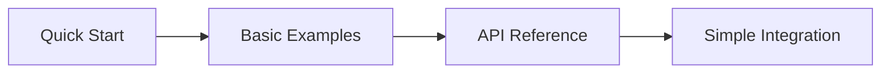
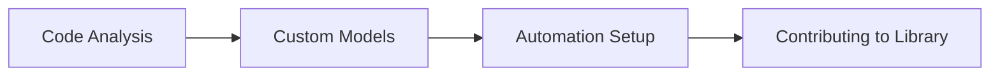

# Rust PaddleOCR 🦀

[](LICENSE)
[](https://www.rust-lang.org)
[](https://crates.io/crates/rust-paddle-ocr)

> A lightweight, efficient OCR (Optical Character Recognition) library in Rust using PaddleOCR models with the MNN inference framework.

---

## 🚀 Quick Start

```rust
use rust_paddle_ocr::OcrEngineManager;
use image::open;

fn main() -> Result<(), Box<dyn std::error::Error>> {
    // Initialize OCR engine (once)
    OcrEngineManager::initialize("models/det_model.mnn", "models/rec_model.mnn", "models/keys.txt")?;

    // Process an image
    let img = open("document.jpg")?;
    let texts = OcrEngineManager::process_ocr(img)?;

    // Print results
    for text in texts {
        println!("Recognized: {}", text);
    }

    Ok(())
}
```

**Installation**: `cargo add rust-paddle-ocr`

---

## 📚 Documentation
###  📚 Documentation Structure
  rust-paddle-ocr/
  ├── README.md                    # 📖 Main documentation index (moved from docs/)
  └── docs/                       # 📁 Documentation folder
      ├── api-reference.md             # 📖 Complete API documentation (864 lines)
      ├── interactive-examples.md      # 🎯 Hands-on code playground (870 lines)
      ├── documentation-automation.md  # 📜 CI/CD and automation (1,386 lines)
      ├── troubleshooting.md           # 🚨 Issues and solutions (1,238 lines)
      ├── code-explanation.md         # 🔧 Code analysis and patterns (594 lines)
      ├── architecture.md             # 🏗️ System architecture (279 lines)
      ├── examples.md                # 📝 Usage examples (603 lines)
      ├── performance.md             # ⚡ Performance guide (478 lines)
      ├── quick-start.md             # 🚀 Getting started (137 lines)
      └── code-analysis.md           # 📊 Technical analysis (433 lines)

### 🎯 New to the Library?
Start here for a smooth learning experience:

1. **[📖 Quick Start Guide](docs/quick-start.md)** - Get running in 5 minutes
2. **[🔧 Installation](docs/installation.md)** - Detailed setup instructions
3. **[🎮 Interactive Examples](docs/interactive-examples.md)** - Hands-on playground
4. **[📋 Basic Usage](docs/basic-usage.md)** - Common patterns and examples

### 🏗️ Understanding the Library
Deep dive into architecture and implementation:

5. **[📖 API Reference](docs/api-reference.md)** - Complete API documentation
6. **[🔍 Code Analysis & Explanation](docs/code-explanation.md)** - Visual code breakdown
7. **[🏗️ Architecture Guide](docs/architecture.md)** - System design overview
8. **[⚡ Performance Guide](docs/performance.md)** - Optimization techniques

### 🛠️ Advanced Usage
For production and complex scenarios:

9. **[📝 Examples Guide](docs/examples.md)** - Comprehensive examples
10. **[🚨 Troubleshooting](docs/troubleshooting.md)** - Issues and solutions
11. **[📜 Documentation Automation](docs/documentation-automation.md)** - CI/CD setup
12. **[🔗 Integration Examples](docs/integration.md)** - Web, CLI, and FFI

### 🤝 Contributing
For developers who want to contribute:

13. **[🤝 Contributing Guide](docs/contributing.md)** - How to contribute
14. **[🛠️ Development Setup](docs/development.md)** - Environment setup
15. **[🧪 Testing Guide](docs/testing.md)** - Running and writing tests

---

## ✨ Key Features

### 🎯 Core Capabilities
- **🔍 Text Detection** - Accurately locate text regions in images
- **📝 Text Recognition** - Recognize text content with high accuracy
- **🌍 Multi-Language Support** - Support for 11+ languages with PP-OCRv5
- **⚡ High Performance** - Optimized for speed and memory efficiency

### 🏗️ Technical Excellence
- **🧵 Thread-Safe** - Concurrent processing with actor pattern
- **💾 Memory Efficient** - Smart cropping and resource management
- **🔧 Production Ready** - Comprehensive error handling and logging
- **🎛️ Flexible API** - Both high-level and low-level interfaces

### 📊 Performance Metrics
| Operation | Speed | Memory Usage |
|-----------|-------|--------------|
| Text Detection | ~50ms per 1024x768 image | ~200MB baseline |
| Text Recognition | ~10ms per text region | +50MB per image |
| Efficient Processing | 20-40% faster | 50-70% less memory |

*Benchmarks on Intel i7-10700K, 32GB RAM*

---

## 🎯 Use Cases

### 🌐 Web Applications
```rust
// Web server integration
async fn ocr_endpoint(bytes: Vec<u8>) -> Result<Vec<String>, StatusCode> {
    let img = image::load_from_memory(&bytes)?;
    let texts = OcrEngineManager::process_ocr(img)?;
    Ok(texts)
}
```

### 🖥️ Desktop Applications
```rust
// Document processing
fn process_document(path: &str) -> OcrResult<Vec<String>> {
    let img = image::open(path)?;
    OcrEngineManager::process_ocr_efficient(img)  // Better for large images
}
```

### 📱 Mobile & Embedded
```rust
// C API for mobile integration
let texts = process_ocr_from_c(image_data, width, height, channels);
```

---

## 🛠️ Installation

### 📦 Cargo (Recommended)
```bash
cargo add rust-paddle-ocr
```

### 🔧 From Source
```bash
git clone https://github.com/zibo-chen/rust-paddle-ocr.git
cd rust-paddle-ocr
cargo build --release
```

### ⚙️ Feature Flags
```toml
[dependencies]
rust-paddle-ocr = { version = "1.4", features = ["fast_resize", "v5"] }
```

- `fast_resize` - Faster image resizing optimizations
- `v5` - PP-OCRv5 model support (recommended)

---

## 📋 System Requirements

### 📱 Minimum
- **Rust**: 1.70+
- **Memory**: 512MB RAM
- **Storage**: 100MB for models
- **OS**: Linux, Windows, macOS

### 🚀 Recommended
- **Rust**: 1.75+
- **Memory**: 2GB+ RAM
- **Storage**: 500MB for models and cache
- **CPU**: Multi-core processor

---

## 🎮 Learning Paths

### 🌱 Beginner Path (1-2 weeks)


**Goal**: Build basic OCR applications

### 🔧 Intermediate Path (2-4 weeks)


**Goal**: Optimize and deploy production applications

### 🚀 Advanced Path (4-6 weeks)


**Goal**: Master the library and contribute to ecosystem

---

## 🚨 Common Issues & Solutions

| Issue | Solution |
|-------|----------|
| **"Engine not initialized"** | Call `initialize()` before processing |
| **Poor recognition accuracy** | Adjust confidence thresholds and preprocessing |
| **High memory usage** | Use `process_ocr_efficient()` for large images |
| **Slow processing** | Enable `fast_resize` feature and optimize image size |

**Need more help?** → [📖 Complete Troubleshooting Guide](docs/troubleshooting.md)

---

## 🤝 Community & Support

### 💬 Getting Help
- **📚 Documentation**: You're here! Check the guides above
- **🐛 Issues**: [Report bugs on GitHub](https://github.com/zibo-chen/rust-paddle-ocr/issues)
- **💬 Discussions**: [Join GitHub Discussions](https://github.com/zibo-chen/rust-paddle-ocr/discussions)
- **📧 Email**: Contact maintainers for private questions

### 🔧 Contributing
We welcome contributions! See the [Contributing Guide](docs/contributing.md) for details.

**Quick ways to help:**
- ⭐ Give the project a star on GitHub
- 🐛 Report bugs and request features
- 📝 Improve documentation
- 💻 Submit pull requests

---

## 📈 Project Status

### ✅ Current Features
- [x] PP-OCRv4 and PP-OCRv5 model support
- [x] Multi-language recognition (11+ languages)
- [x] Thread-safe concurrent processing
- [x] Memory-efficient image processing
- [x] C API for FFI integration
- [x] Comprehensive error handling
- [x] Performance optimization tools

### 🚧 In Development
- [ ] GPU acceleration support
- [ ] WebAssembly compilation
- [ ] Real-time video processing
- [ ] Additional model format support

### 🎯 Roadmap
- [ ] Distributed processing capabilities
- [ ] Cloud-native deployment tools
- [ ] Advanced language model integration
- [ ] Mobile optimization suite

---

## 🔗 Related Projects

| Project | Description |
|---------|-------------|
| **[PaddleOCR](https://github.com/PaddlePaddle/PaddleOCR)** | Original Python implementation |
| **[MNN](https://github.com/alibaba/MNN)** | Mobile Neural Network framework |
| **[mnn-rs](https://github.com/aftershootco/mnn-rs)** | Rust bindings for MNN |
| **[image-rs](https://github.com/image-rs/image)** | Image processing in Rust |

---

## 📄 License

This project is licensed under the Apache License 2.0 - see the [LICENSE](LICENSE) file for details.

---

## 🙏 Acknowledgments

- **[PaddleOCR Team](https://github.com/PaddlePaddle/PaddleOCR)** - For the excellent OCR models
- **[MNN Team](https://github.com/alibaba/MNN)** - For the efficient inference framework
- **[Rust Community](https://www.rust-lang.org/community)** - For the amazing language and ecosystem

---

<div align="center">

**🦀 Happy coding with Rust PaddleOCR! 🦀**

If you find this library helpful, please consider giving it a ⭐ on GitHub!

[⭐ Star us](https://github.com/zibo-chen/rust-paddle-ocr) • [📚 Documentation](docs/) • [🐛 Issues](https://github.com/zibo-chen/rust-paddle-ocr/issues) • [💬 Discussions](https://github.com/zibo-chen/rust-paddle-ocr/discussions)

</div>