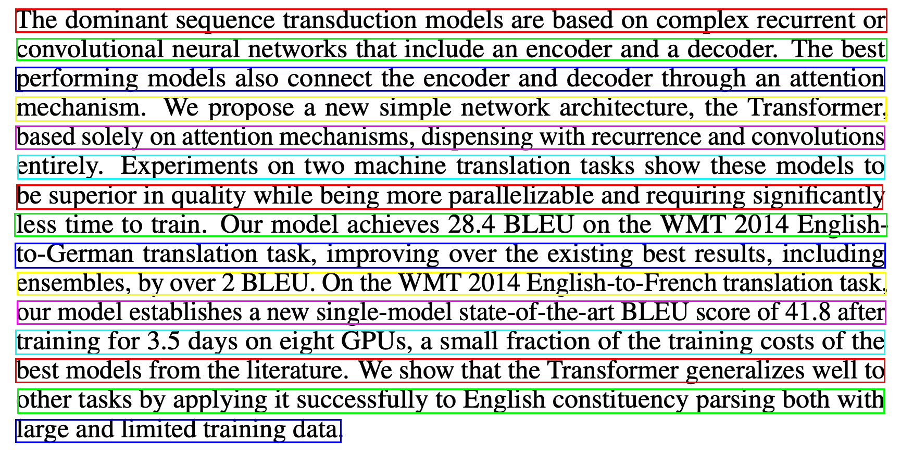
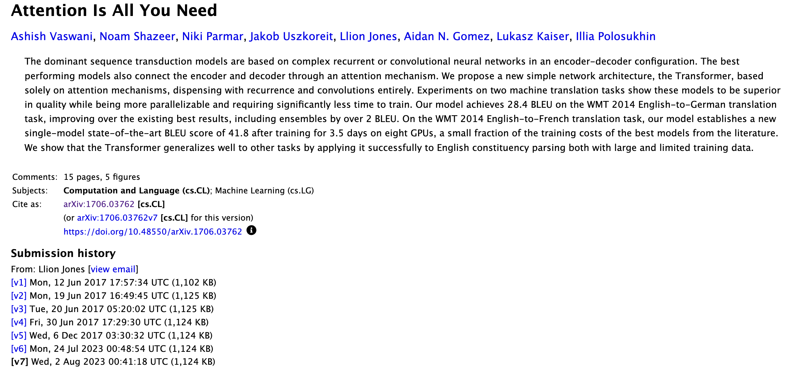
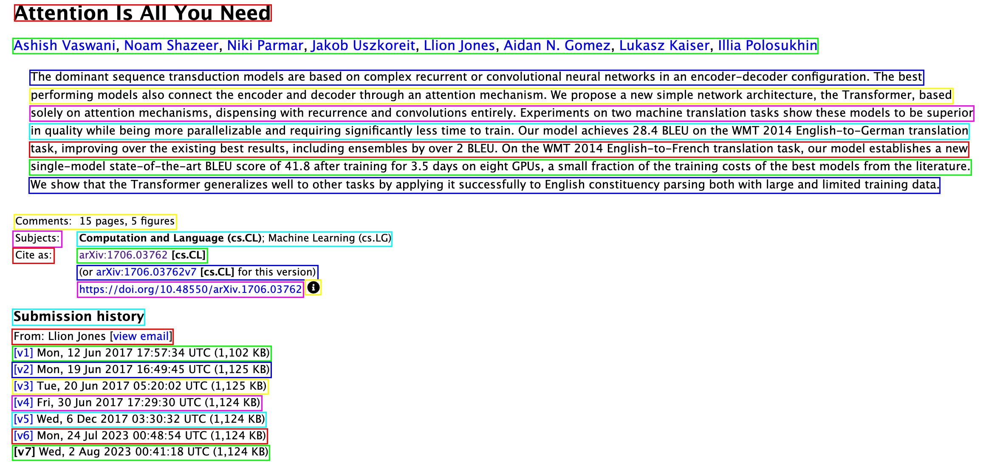
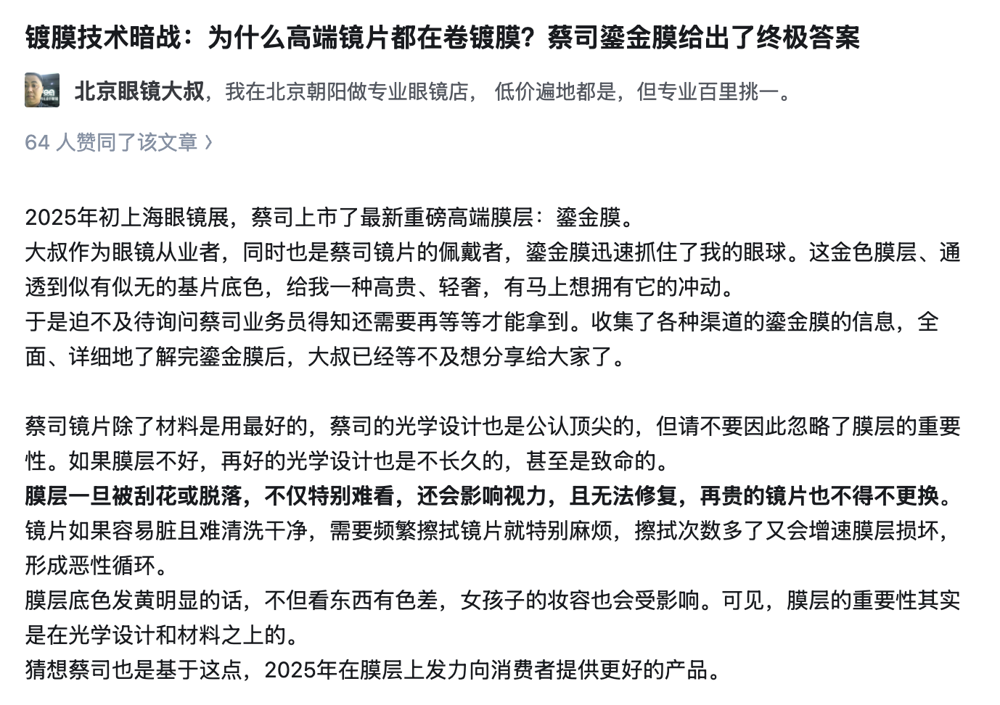
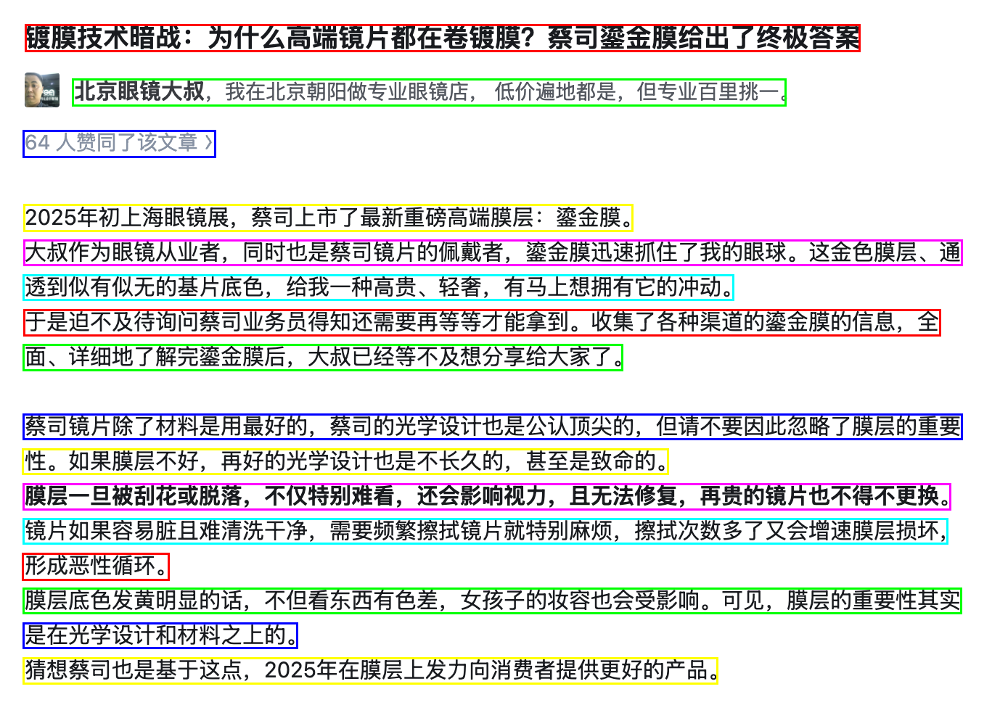

# Rust PaddleOCR

[English](README.md) | [中文](README.zh.md) | [日本語](README.ja.md) | [한국어](README.ko.md)

一个基于PaddleOCR模型的轻量级高效OCR（光学字符识别）Rust库。该库利用MNN推理框架提供高性能的文本检测和识别功能。

[](LICENSE)

## 特性

- **文本检测**：准确定位图像中的文本区域
- **文本识别**：识别检测区域中的文本内容
- **高性能**：使用MNN推理框架优化
- **最小依赖**：轻量级且易于集成
- **可自定义**：针对不同用例的可调整参数
- **命令行工具**：提供简单的命令行界面进行OCR识别

## 安装

在`Cargo.toml`中添加：

```toml
[dependencies.rust-paddle-ocr]
git = "https://github.com/zibo-chen/rust-paddle-ocr.git"
```

您也可以指定特定分支或标签：

```toml
[dependencies.rust-paddle-ocr]
git = "https://github.com/zibo-chen/rust-paddle-ocr.git"
branch = "main"
```

### 前提条件

该库需要：
- 转换为MNN格式的预训练PaddleOCR模型
- 用于文本识别的字符集文件

## 命令行工具

该库提供了一个内置的命令行工具，可以直接进行OCR识别：

```bash
# 基本用法
./ocr -p path/to/image.jpg

# 输出JSON格式（包含详细信息和位置）
./ocr -p path/to/image.jpg -m json

# 显示详细日志信息
./ocr -p path/to/image.jpg -v
```

### 命令行选项

```
选项:
  -p, --path <IMAGE_PATH>  要识别的图像路径
  -m, --mode <MODE>        输出模式: json(详细) 或 text(简单) [默认: text]
  -v, --verbose            是否显示详细日志
  -h, --help               显示帮助信息
  -V, --version            显示版本信息
```

## 使用示例

```rust
use rust_paddle_ocr::{Det, Rec};
use image::open;

fn main() -> Result<(), Box<dyn std::error::Error>> {
    // 加载检测模型
    let mut det = Det::from_file("path/to/det_model.mnn")?;
    
    // 自定义检测参数（可选）
    let det = det
        .with_rect_border_size(50)
        .with_merge_boxes(true)
        .with_merge_threshold(10);
    
    // 加载识别模型
    let mut rec = Rec::from_file("path/to/rec_model.mnn", "path/to/keys.txt")?;
    
    // 自定义识别参数（可选）
    let rec = rec
        .with_min_score(0.6)
        .with_punct_min_score(0.1);
    
    // 打开图像
    let img = open("path/to/image.jpg")?;
    
    // 检测文本区域
    let text_images = det.find_text_img(&img)?;
    
    // 识别每个检测区域中的文本
    for text_img in text_images {
        let text = rec.predict_str(&text_img)?;
        println!("识别的文本: {}", text);
    }
    
    Ok(())
}
```

## API 参考

### 文本检测 (Det)

```rust
// 创建新的检测器
let mut det = Det::from_file("path/to/det_model.mnn")?;

// 查找文本区域并返回矩形
let rects = det.find_text_rect(&img)?;

// 查找文本区域并返回裁剪后的图像
let text_images = det.find_text_img(&img)?;

// 自定义选项
let det = det
    .with_rect_border_size(50)      // 设置检测区域的边框大小
    .with_merge_boxes(true)         // 启用/禁用合并相邻框
    .with_merge_threshold(10);      // 设置框合并的阈值
```

### 文本识别 (Rec)

```rust
// 创建新的识别器
let mut rec = Rec::from_file("path/to/rec_model.mnn", "path/to/keys.txt")?;

// 识别文本并返回字符串
let text = rec.predict_str(&text_img)?;

// 识别文本并返回带有置信度分数的字符
let char_scores = rec.predict_char_score(&text_img)?;

// 自定义选项
let rec = rec
    .with_min_score(0.6)           // 设置普通字符的最低置信度
    .with_punct_min_score(0.1);    // 设置标点符号的最低置信度
```

## 性能优化

该库包含几项优化：
- 高效的张量管理
- 智能框合并用于文本检测
- 自适应图像预处理
- 可配置的置信度阈值

## 示例结果

以下是一些展示库实际效果的示例结果：

### 示例 1



### 示例 2



### 示例 3



## 许可证

该项目采用Apache许可证2.0版 - 详情请参阅[LICENSE](LICENSE)文件。

## 致谢

- [PaddleOCR](https://github.com/PaddlePaddle/PaddleOCR) - 提供原始OCR模型和研究
- [MNN](https://github.com/alibaba/MNN) - 提供高效的神经网络推理框架
- [mnn-rs](https://github.com/aftershootco/mnn-rs) - 为Rust提供了MNN绑定
