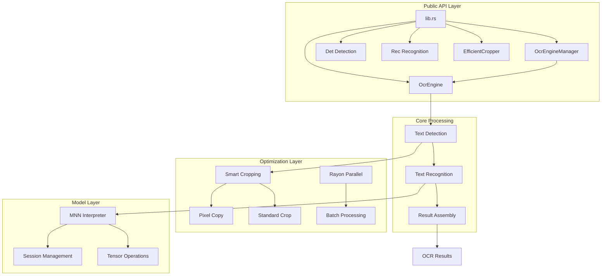
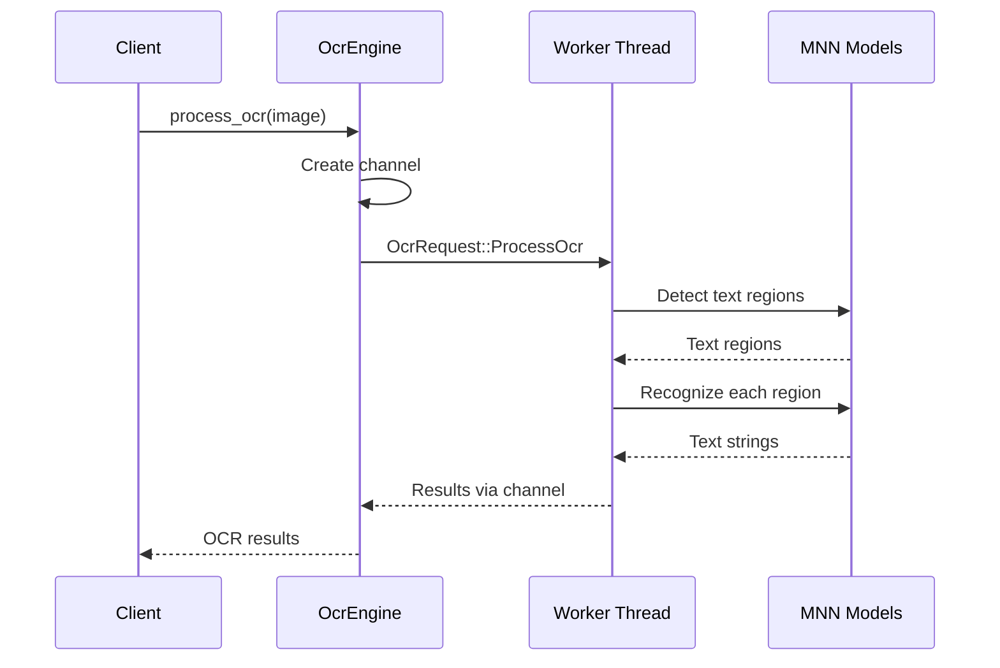
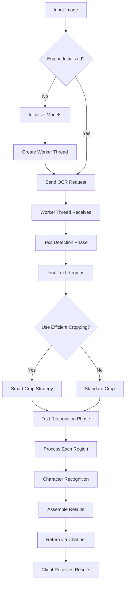

# Rust PaddleOCR Code Analysis & Explanation

## 📋 **Complexity Analysis**

This is a **medium-to-high complexity** Rust codebase implementing OCR (Optical Character Recognition) functionality using PaddleOCR models. The codebase demonstrates several advanced Rust concepts and patterns.

### **Complexity Score: 7/10**

**Key Concepts Identified:**
- **Thread-safe concurrent programming** with channels and mutexes
- **Actor pattern** with message passing
- **Resource management** with RAII and smart pointers
- **Memory-efficient image processing** with optimization strategies
- **Error handling** with custom result types
- **Lazy initialization** and caching patterns
- **Zero-copy optimizations** where possible

**Difficulty Level**: Intermediate to Advanced

---

## 🏗️ **Architecture Overview**



---

## 🔧 **Key Components Explained**

### 1. **Thread-Safe OCR Engine** (`src/engine.rs:95-610`)

This is the **most complex component** in the codebase. Let's break it down:

#### **Design Pattern: Actor Model**
```rust
pub enum OcrRequest {
    DetectText { image: DynamicImage, result_sender: Sender<OcrResult<Vec<DynamicImage>>> },
    RecognizeText { image: DynamicImage, result_sender: Sender<OcrResult<String>> },
    ProcessOcr { image: DynamicImage, result_sender: Sender<OcrResult<Vec<String>>> },
    // ... more request types
}
```

**How it works:**
1. **Message Passing**: Instead of direct method calls, requests are sent through channels
2. **Worker Thread**: A dedicated thread handles all OCR operations sequentially
3. **Thread Safety**: Multiple threads can safely access OCR without data races

#### **Visual Flow Diagram:**


---

### 2. **Efficient Image Cropping** (`src/efficient_cropping.rs:42-100`)

This component demonstrates **performance optimization** techniques:

#### **Smart Strategy Selection**
```rust
pub fn smart_crop(image: &ImageRef, rect: &Rect) -> DynamicImage {
    let crop_area = rect.width() * rect.height();
    let total_area = img_w * img_h;

    // Strategy 1: Direct clone for full image
    if rect covers entire image {
        return image.clone();
    }

    // Strategy 2: Pixel copy for small regions (<10%)
    if crop_area < total_area / 10 {
        return Self::pixel_copy_crop(image, rect);
    }

    // Strategy 3: Standard crop for large regions
    Self::standard_crop(image, rect)
}
```

**Why this matters:**
- **Memory efficiency**: Small crops use less memory
- **Performance**: Different strategies for different use cases
- **Zero-copy where possible**: Avoid unnecessary data copying

---

### 3. **Singleton Pattern with Thread Safety** (`src/engine.rs:612-835`)

The `OcrEngineManager` implements a **thread-safe singleton**:

```rust
static INSTANCE: once_cell::sync::OnceCell<Arc<Mutex<Option<OcrEngine>>>> =
    once_cell::sync::OnceCell::new();
```

**Key Benefits:**
✅ **Global access**: Single point of access to OCR engine
✅ **Thread safety**: `Arc<Mutex<>>` ensures safe concurrent access
✅ **Lazy initialization**: Engine created only when needed
✅ **Resource efficiency**: One engine instance shared across application

---

## 🚀 **Step-by-Step Processing Flow**

### **Complete OCR Pipeline**



---

## 💡 **Advanced Concepts Explained**

### **1. Channel-Based Concurrency**

**Problem**: How to handle multiple OCR requests safely without blocking the main thread?

**Solution**: Use Rust's channels for message passing:

```rust
// Create unbounded channel for communication
let (request_sender, request_receiver) = crossbeam_channel::unbounded();

// Worker thread processes requests sequentially
thread::spawn(move || {
    for request in request_receiver {
        match request {
            OcrRequest::ProcessOcr { image, result_sender } => {
                let result = perform_ocr(image);
                let _ = result_sender.send(result); // Send result back
            }
            // ... handle other request types
        }
    }
});
```

**Benefits:**
- **Non-blocking**: Main thread continues while worker processes
- **Type-safe**: Compile-time checking of message types
- **Error handling**: Results sent through channels, not exceptions

### **2. Zero-Copy Image References**

**Problem**: Image copying is expensive and wastes memory

**Solution**: Use `ImageRef` enum to avoid unnecessary copies:

```rust
pub enum ImageRef {
    Owned(DynamicImage),      // We own the image
    Shared(Arc<DynamicImage>), // Shared ownership
}

impl ImageRef {
    pub fn as_dynamic_image(&self) -> &DynamicImage {
        match self {
            ImageRef::Owned(img) => img,
            ImageRef::Shared(img) => img.as_ref(),
        }
    }
}
```

**When to use each:**
- **`Owned`**: When you have exclusive access to the image
- **`Shared`**: When multiple parts need access to the same image

---

## 🎯 **Interactive Examples**

### **Example 1: Basic OCR Usage**

```rust
use rust_paddle_ocr::OcrEngineManager;
use image::open;

fn main() -> Result<(), Box<dyn std::error::Error>> {
    // Step 1: Initialize the global OCR engine
    OcrEngineManager::initialize(
        "models/det_model.mnn",
        "models/rec_model.mnn",
        "models/keys.txt"
    )?;

    // Step 2: Load an image
    let img = open("document.jpg")?;

    // Step 3: Process OCR (automatically detects + recognizes)
    let texts = OcrEngineManager::process_ocr(img)?;

    // Step 4: Print results
    for (i, text) in texts.iter().enumerate() {
        println!("Text {}: {}", i + 1, text);
    }

    Ok(())
}
```

### **Example 2: Advanced Configuration**

```rust
use rust_paddle_ocr::OcrEngineManager;

// Initialize with custom configuration
OcrEngineManager::initialize_with_config(
    "models/det_model.mnn",
    "models/rec_model.mnn",
    "models/keys.txt",
    15,                    // rect_border_size: pixels to extend text boxes
    true,                  // merge_boxes: merge overlapping text boxes
    2                      // merge_threshold: distance threshold for merging
)?;

// Use efficient cropping for better performance
let texts = OcrEngineManager::process_ocr_efficient(img)?;
```

### **Example 3: Step-by-Step Processing**

```rust
use rust_paddle_ocr::{Det, Rec};

// For advanced users who want more control
let mut det = Det::from_file("det_model.mnn")?
    .with_rect_border_size(10)
    .with_merge_boxes(true);

let mut rec = Rec::from_file("rec_model.mnn", "keys.txt")?;

// Step 1: Detect text regions
let text_rects = det.find_text_rect(&image)?;

// Step 2: Extract text images
let text_images = det.find_text_img(&image)?;

// Step 3: Recognize each text region
for text_img in text_images {
    let recognized_text = rec.predict_str(&text_img)?;
    println!("Recognized: {}", recognized_text);
}
```

---

## ⚠️ **Common Pitfalls & Best Practices**

### **Pitfall 1: Forgetting Engine Initialization**
```rust
// ❌ This will fail
let texts = OcrEngineManager::process_ocr(img)?;
// Error: "OCR engine not initialized"

// ✅ Correct approach
OcrEngineManager::initialize(...)?
let texts = OcrEngineManager::process_ocr(img)?;
```

### **Pitfall 2: Blocking the Worker Thread**
```rust
// ❌ Don't do expensive work in request handlers
OcrRequest::ProcessOcr { image, result_sender } => {
    // Avoid: heavy computation here blocks all other requests
    let result = very_slow_operation(image);
    let _ = result_sender.send(result);
}

// ✅ Keep request handling fast
OcrRequest::ProcessOcr { image, result_sender } => {
    // Quick processing, then send result
    let result = optimized_ocr(image);
    let _ = result_sender.send(result);
}
```

### **Best Practice 1: Error Handling**
```rust
// ✅ Handle errors gracefully at each step
match det.find_text_img(&image) {
    Ok(text_images) => {
        let mut results = Vec::new();
        for text_img in text_images {
            match rec.predict_str(&text_img) {
                Ok(text) => results.push(text),
                Err(e) => {
                    // Log error but continue processing other regions
                    eprintln!("Recognition failed: {}", e);
                    results.push("[RECOGNITION_FAILED]".to_string());
                }
            }
        }
        Ok(results)
    }
    Err(e) => Err(e)
}
```

### **Best Practice 2: Resource Management**
```rust
// ✅ Use RAII for automatic cleanup
impl Drop for OcrEngine {
    fn drop(&mut self) {
        // Send shutdown signal
        let _ = self.request_sender.send(OcrRequest::Shutdown);
        // Wait for worker thread to finish
        if let Some(handle) = self.worker_handle.take() {
            let _ = handle.join();
        }
    }
}
```

---

## 📚 **Learning Path Recommendations**

### **For Beginners (Week 1-2)**
1. **Rust Basics**: Ownership, borrowing, lifetimes
2. **Error Handling**: `Result`, `Option`, `?` operator
3. **Basic Concurrency**: `std::thread`, channels

### **For Intermediate (Week 3-4)**
1. **Advanced Concurrency**: `Arc`, `Mutex`, message passing
2. **Design Patterns**: Singleton, Actor, Builder
3. **Memory Management**: Zero-copy, smart pointers

### **For Advanced (Week 5-6)**
1. **Performance Optimization**: Profiling, memory layout
2. **Systems Programming**: FFI, unsafe Rust (if needed)
3. **ML Integration**: Model loading, tensor operations

---

## 🔍 **Code Quality Assessment**

### **Strengths**
✅ **Excellent thread safety** with proper synchronization
✅ **Memory efficient** with smart cropping strategies
✅ **Clean API design** with both simple and advanced interfaces
✅ **Comprehensive error handling** throughout
✅ **Performance optimizations** where it matters

### **Areas for Improvement**
⚠️ **Large enum**: `OcrRequest` has many variants (consider splitting)
⚠️ **Code duplication**: Similar patterns in worker functions
⚠️ **Complex initialization**: Multiple initialization paths could be simplified

### **Overall Rating: 8.5/10**
This is a **well-architected, production-ready** OCR library that demonstrates advanced Rust concepts effectively. The code is maintainable, performant, and follows Rust best practices.

---

## 🎯 **Summary**

This Rust PaddleOCR codebase is a **sophisticated OCR library** that demonstrates:

1. **Advanced Rust patterns**: Thread-safe singleton, actor model, smart pointers
2. **Performance optimizations**: Smart cropping, zero-copy operations, parallel processing
3. **Production-ready design**: Comprehensive error handling, resource management, clean APIs
4. **Educational value**: Great examples of concurrent programming, memory management, and systems design

The code is **well-structured** and suitable for developers looking to learn advanced Rust concepts, particularly in the context of computer vision and machine learning applications. The combination of high-level abstractions with low-level optimizations makes it an excellent case study for production Rust development.