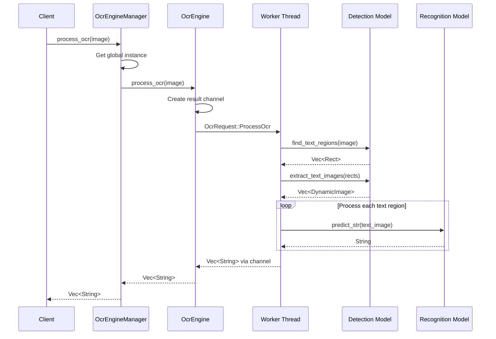

# Architecture Guide

## 🏗️ System Architecture

The Rust PaddleOCR library is built with a modular, thread-safe architecture that separates concerns and enables high-performance text recognition.

## Core Components

### 1. Public API Layer (`lib.rs`)

The main entry point that exposes:
- `OcrEngineManager` - Global singleton for easy access
- `OcrEngine` - Thread-safe engine instance
- `Det` - Text detection model
- `Rec` - Text recognition model
- `EfficientCropper` - Performance optimization utilities

### 2. Engine Layer (`engine.rs`)

#### Actor Pattern Implementation

The engine uses an actor pattern with message passing:

```rust
pub enum OcrRequest {
    DetectText { image: DynamicImage, result_sender: Sender<OcrResult<Vec<DynamicImage>>> },
    RecognizeText { image: DynamicImage, result_sender: Sender<OcrResult<String>> },
    ProcessOcr { image: DynamicImage, result_sender: Sender<OcrResult<Vec<String>>> },
    // ... more request types
}
```

**Benefits:**
- Thread-safe operations
- Non-blocking API
- Sequential model processing (prevents race conditions)
- Clean separation of concerns

#### Singleton Pattern

```rust
pub struct OcrEngineManager {
    _private: (),
}

static INSTANCE: once_cell::sync::OnceCell<Arc<Mutex<Option<OcrEngine>>>> =
    once_cell::sync::OnceCell::new();
```

**Why Singleton?**
- Single model instance saves memory
- Prevents multiple model loading
- Global access for convenience
- Thread-safe sharing

### 3. Model Layer

#### Text Detection (`det.rs`)

```rust
pub struct Det {
    interpreter: Interpreter,
    session: Option<mnn::Session>,
    rect_border_size: u32,
    merge_boxes: bool,
    merge_threshold: i32,
    // Performance optimizations
    input_tensor_name: Option<String>,
    output_tensor_name: Option<String>,
    last_input_shape: Option<[i32; 4]>,
}
```

**Key Features:**
- MNN framework integration
- Configurable text box parameters
- Caching for performance
- Multiple initialization methods

#### Text Recognition (`rec.rs`)

```rust
pub struct Rec {
    interpreter: Interpreter,
    session: Option<mnn::Session>,
    keys: Vec<char>,
    min_score: f32,
    punct_min_score: f32,
    #[cfg(feature = "fast_resize")]
    resizer: fast_image_resize::Resizer,
}
```

**Key Features:**
- Character-based recognition
- Score thresholding
- Optional fast resizing
- Punctuation handling

### 4. Optimization Layer (`efficient_cropping.rs`)

#### Smart Cropping Strategy

```rust
pub fn smart_crop(image: &ImageRef, rect: &Rect) -> DynamicImage {
    let crop_area = rect.width() * rect.height();
    let total_area = img_w * img_h;

    // Strategy selection based on crop size
    if crop_area < total_area / 10 {
        Self::pixel_copy_crop(image, rect)
    } else {
        Self::standard_crop(image, rect)
    }
}
```

**Optimization Techniques:**
- Strategy selection based on crop size
- Zero-copy references when possible
- Pixel-level operations for small regions
- Parallel processing with Rayon

## Data Flow



## Thread Safety

### Synchronization Mechanisms

1. **Channels** (`crossbeam_channel`)
   - Request/response communication
   - Type-safe message passing
   - No shared mutable state

2. **Mutex** (`std::sync::Mutex`)
   - Protects global engine instance
   - Ensures exclusive access during initialization

3. **Arc** (`std::sync::Arc`)
   - Shared ownership of engine
   - Thread-safe reference counting

### Memory Safety

- **No data races**: All shared data protected by synchronization
- **RAII**: Automatic resource cleanup with `Drop` trait
- **Zero-copy**: Minimize unnecessary cloning
- **Smart pointers**: Proper ownership management

## Performance Considerations

### Memory Management

1. **Lazy Loading**
   ```rust
   session: Option<mnn::Session>,  // Created on first use
   ```

2. **Caching**
   ```rust
   input_tensor_name: Option<String>,  // Cache tensor names
   last_input_shape: Option<[i32; 4]>, // Avoid unnecessary resizes
   ```

3. **Zero-Copy References**
   ```rust
   pub enum ImageRef {
       Owned(DynamicImage),
       Shared(Arc<DynamicImage>),
   }
   ```

### Parallel Processing

- **Rayon Integration**: Parallel image processing
- **Worker Thread**: Dedicated thread for model operations
- **Non-blocking API**: Main thread continues while processing

## Error Handling

### Error Types

```rust
pub enum OcrError {
    ModelLoadError(String),
    InferenceError(String),
    ImageError(String),
    EngineError(String),
}
```

### Error Propagation

- **Result Type**: All operations return `OcrResult<T>`
- **Early Returns**: Use `?` operator for clean error handling
- **Graceful Degradation**: Continue processing when possible

## Configuration

### Model Configuration

- **Detection Model**: Text region identification
- **Recognition Model**: Character recognition
- **Character Set**: Customizable character mapping

### Processing Configuration

- **Border Size**: Text box extension pixels
- **Merge Boxes**: Combine overlapping text regions
- **Merge Threshold**: Distance for box merging
- **Score Thresholds**: Confidence thresholds for recognition

## Extensibility

### Adding New Models

1. Implement model interface
2. Add to request enum
3. Update worker thread logic
4. Expose in public API

### Adding New Optimizations

1. Implement in `efficient_cropping.rs`
2. Add strategy selection logic
3. Benchmark performance improvements
4. Update documentation

## Testing Strategy

### Unit Tests

- Model loading and inference
- Image processing functions
- Error handling paths
- Configuration validation

### Integration Tests

- End-to-end OCR pipeline
- Thread safety under load
- Memory usage validation
- Performance benchmarks

### Examples

- Basic usage patterns
- Advanced configuration
- Performance optimization
- Error handling scenarios